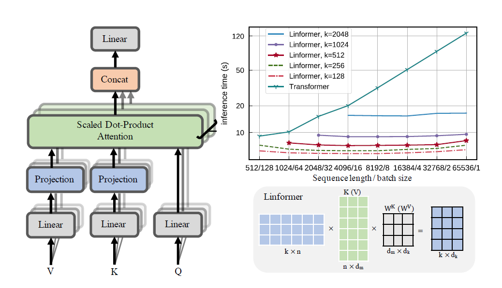

# Linformer Pytorch Implementation
[](https://badge.fury.io/py/linformer-pytorch)



A practical implementation of the [Linformer paper](https://arxiv.org/pdf/2006.04768.pdf). This is attention with only linear complexity in n, allowing for very long sequence lengths (1mil+) to be attended to on modern hardware.

This repo is an [Attention Is All You Need](https://arxiv.org/pdf/1706.03762.pdf) style transformer, complete with an encoder and decoder module. The novelty here is that now, one can make the attention heads linear. Check out how to use it below.

This is in the process of being validated on wikitext-2. Currently, it performs at the same level as other sparse attention mechanisms, like the [Sinkhorn Transformer](https://github.com/lucidrains/sinkhorn-transformer), but the best hyperparameters still have to be found.

Visualization of the heads is also possible. To see more information, check out the Visualization section below.

I am not the author of the paper.

[](https://colab.research.google.com/drive/1zHenqau3rMo3oS_7EisfGsahSs-1_sok?usp=sharing) 1.23m tokens

## Install
```
pip install linformer-pytorch
```

Alternatively,

```
git clone https://github.com/tatp22/linformer-pytorch.git
cd linformer-pytorch
```

## Code example
Linformer Language Model

```python
from linformer_pytorch import LinformerLM
import torch

model = LinformerLM(
        num_tokens=10000, # Number of tokens in the LM
        input_size=512, # Dimension 1 of the input
        channels=64, # Dimension 2 of the input
        dim_d=None, # Overwrites the inner dim of the attention heads. If None, sticks with the recommended channels // nhead, as in the "Attention is all you need" paper
        dim_k=128, # The second dimension of the P_bar matrix from the paper
        dim_ff=128, # Dimension in the feed forward network
        dropout_ff=0.15, # Dropout for feed forward network
        nhead=4, # Number of attention heads
        depth=2, # How many times to run the model
        dropout=0.1, # How much dropout to apply to P_bar after softmax
        activation="gelu", # What activation to use. Currently, only gelu and relu supported, and only on ff network.
        use_pos_emb=True, # Whether or not to use positional embeddings
        checkpoint_level="C0", # What checkpoint level to use. For more information, see below.
        parameter_sharing="layerwise", # What level of parameter sharing to use. For more information, see below.
        k_reduce_by_layer=0, # Going down `depth`, how much to reduce `dim_k` by, for the `E` and `F` matrices. Will have a minimum value of 1.
        full_attention=False, # Use full attention instead, for O(n^2) time and space complexity. Included here just for comparison
        include_ff=True, # Whether or not to include the Feed Forward layer
        w_o_intermediate_dim=None, # If not None, have 2 w_o matrices, such that instead of `dim*nead,channels`, you have `dim*nhead,w_o_int`, and `w_o_int,channels`
        emb_dim=128, # If you want the embedding dimension to be different than the channels for the Linformer
        causal=False, # If you want this to be a causal Linformer, where the upper right of the P_bar matrix is masked out.
        method="learnable", # The method of how to perform the projection. Supported methods are 'convolution', 'learnable', and 'no_params'
        ff_intermediate=None, # See the section below for more information
        ).cuda()
x = torch.randint(1,10000,(1,512)).cuda()
y = model(x)
print(y) # (1, 512, 10000)

```

Linformer self attention, stacks of `MHAttention` and `FeedForward`s

```python
from linformer_pytorch import Linformer
import torch

model = Linformer(
        input_size=262144, # Dimension 1 of the input
        channels=64, # Dimension 2 of the input
        dim_d=None, # Overwrites the inner dim of the attention heads. If None, sticks with the recommended channels // nhead, as in the "Attention is all you need" paper
        dim_k=128, # The second dimension of the P_bar matrix from the paper
        dim_ff=128, # Dimension in the feed forward network
        dropout_ff=0.15, # Dropout for feed forward network
        nhead=4, # Number of attention heads
        depth=2, # How many times to run the model
        dropout=0.1, # How much dropout to apply to P_bar after softmax
        activation="gelu", # What activation to use. Currently, only gelu and relu supported, and only on ff network.
        checkpoint_level="C0", # What checkpoint level to use. For more information, see below.
        parameter_sharing="layerwise", # What level of parameter sharing to use. For more information, see below.
        k_reduce_by_layer=0, # Going down `depth`, how much to reduce `dim_k` by, for the `E` and `F` matrices. Will have a minimum value of 1.
        full_attention=False, # Use full attention instead, for O(n^2) time and space complexity. Included here just for comparison
        include_ff=True, # Whether or not to include the Feed Forward layer
        w_o_intermediate_dim=None, # If not None, have 2 w_o matrices, such that instead of `dim*nead,channels`, you have `dim*nhead,w_o_int`, and `w_o_int,channels`
        ).cuda()
x = torch.randn(1, 262144, 64).cuda()
y = model(x)
print(y) # (1, 262144, 64)
```

Linformer Multihead attention

```python
from linformer_pytorch import MHAttention
import torch

model = MHAttention(
        input_size=512, # Dimension 1 of the input
        channels=64, # Dimension 2 of the input
        dim=8, # Dim of each attn head
        dim_k=128, # What to sample the input length down to
        nhead=8, # Number of heads
        dropout=0, # Dropout for each of the heads
        activation="gelu", # Activation after attention has been concat'd
        checkpoint_level="C2", # If C2, checkpoint each of the heads
        parameter_sharing="layerwise", # What level of parameter sharing to do
        E_proj, F_proj, # The E and F projection matrices
        full_attention=False, # Use full attention instead
        w_o_intermediate_dim=None, # If not None, have 2 w_o matrices, such that instead of `dim*nead,channels`, you have `dim*nhead,w_o_int`, and `w_o_int,channels`
        )
x = torch.randn(1, 512, 64)
y = model(x)
print(y) # (1, 512, 64)
```

The Linear attention head, the novelty of the paper

```python
from linformer_pytorch import LinearAttentionHead
import torch

model = LinearAttentionHead(
        dim=64, # Dim 2 of the input
        dropout=0.1, # Dropout of the P matrix
        E_proj, F_proj, # The E and F layers
        full_attention=False, # Use Full Attention instead
        )
x = torch.randn(1, 512, 64)
y = model(x, x, x)
print(y) # (1, 512, 64)
```

An encoder/decoder module.

Note: For causal sequences, one can set the `causal=True` flag on in the `LinformerLM` to mask out the top right in the `(n,k)` attention matrix.

```python
import torch
from linformer_pytorch import LinformerLM

encoder = LinformerLM(
    num_tokens=10000,
    input_size=512,
    channels=16,
    dim_k=16,
    dim_ff=32,
    nhead=4,
    depth=3,
    activation="relu",
    k_reduce_by_layer=1,
    return_emb=True,
    )
decoder = LinformerLM(
    num_tokens=10000,
    input_size=512,
    channels=16,
    dim_k=16,
    dim_ff=32,
    nhead=4,
    depth=3,
    activation="relu",
    decoder_mode=True,
    )

x = torch.randint(1,10000,(1,512))
y = torch.randint(1,10000,(1,512))

x_mask = torch.ones_like(x).bool()
y_mask = torch.ones_like(y).bool()

enc_output = encoder(x, input_mask=x_mask)
print(enc_output.shape) # (1, 512, 128)
dec_output = decoder(y, embeddings=enc_output, input_mask=y_mask, embeddings_mask=x_mask)
print(dec_output.shape) # (1, 512, 10000)
```

An easy way to get the `E` and `F` matrices can be done by calling the `get_EF` function. As an example, for an `n` of `1000` and a `k` of `100`:

```python
from linfromer_pytorch import get_EF
import torch

E = get_EF(1000, 100)
```

## Downsampling Methods

With the `methods` flag, one can set the method that the linformer performs downsampling. Currently, three methods are supported:

* `learnable`: This downsampling method creates a learnable `n,k` `nn.Linear` module.
* `convolution`: This downsampling method creates a 1d convolution, with stride length and kernel size `n/k`.
* `no_params`: This creates a fixed `n,k` matrix with values fron N(0,1/k)

In the future, I may include pooling or something else. But for now, these are the options that exist.

## Checkpoint levels
As an attempt to further introduce memory savings, the concept of checkpoint levels have been introduced. The current three checkpoint levels are `C0`, `C1`, and `C2`. When going up checkpoint levels, one sacrifices speed for memory savings. That is, checkpoint level `C0` is the fastest, but takes up the most space on the GPU, while `C2` is the slowest, but takes up the least space on the GPU. The details of each checkpoint level are as follows:
* `C0`: No checkpointing. The models runs while keeping all of the attention heads and ff layers in the GPU memory.
* `C1`: Checkpoint each MultiHead attention as well as each ff layer. With this, increasing `depth` should have minimal impact on the memory.
* `C2`: Along with the optimizations at the `C1` level, checkpoint each head in each MultiHead Attention layer. With this, increasing `nhead` should have less of an impact on memory. However, concating the heads together with `torch.cat` still takes up a lot of memory, and this will hopefully be optimized out in the future.

Performance details are still unknown, but the option exists for users that want to try.

## Parameter Sharing
Another attempt to introduce memory savings in the paper was to introduce parameter sharing between projections. This is mentioned in section 4 of the paper; in particular, there were 4 different types of parameter sharing that the authors discussed, and all have been implemented in this repo. The first option takes up the most memory, and each further option reduces the necessary memory requirements.
* `none`: This is no parameter sharing. For every head and for every layer, a new `E` and a new `F` matrix is calculated for every head at each layer.
* `headwise`: Each layer has a unique `E` and `F` matrix. All heads in the layer share this matrix.
* `kv`: Each layer has a unique projection matrix `P`, and `E = F = P` for each layer. All heads share this projection matrix `P`.
* `layerwise`: There is one projection matrix `P`, and every head in every layer uses `E = F = P`.

As started in the paper, this means that for a 12 layer, 12 head network, there would be `288`, `24`, `12` and `1` different projection matrices, respectively.

Note that with the `k_reduce_by_layer` option, the `layerwise` option will not be effective, since it will use the dimension of `k` for the first layer. Therefore, if the value of `k_reduce_by_layer` value is greater than `0`, one should most likely not use the `layerwise` sharing option.

Also, note that according to the authors, in figure 3, this parameter sharing doesn't really affect the end result too much. So it may be best to just stick with `layerwise` sharing for everything, but the option exists for users to try it out.

## Padder
One slight problem with the current implementation of the Linformer is that your sequence length has to match the `input_size` flag of the model. The Padder pads the input size such that the tensor can be fed into the network. An example:

```python
from linformer_pytorch import Linformer, Padder
import torch

model = Linformer(
        input_size=512,
        channels=16,
        dim_d=32,
        dim_k=16,
        dim_ff=32,
        nhead=6,
        depth=3,
        checkpoint_level="C1",
        )
model = Padder(model)
x = torch.randn(1, 500, 16) # This does not match the input size!
y = model(x)
print(y) # (1, 500, 16)
```

## Visualization


Starting with version `0.8.0`, one can now visualize the attention heads of the linformer! To see this in action, simply import the `Visualizer` class, and run the `plot_all_heads()` function to see a picture of all the attention heads at each level, of size (n,k). Make sure that you specify `visualize=True` in the forward pass, as this saves the `P_bar` matrix so that the `Visualizer` class can properly visualize the head.

A working example of the code can be found below, and the same code can be found in `./examples/example_vis.py`:

```python
import torch
from linformer_pytorch import Linformer, Visualizer

model = Linformer(
        input_size=512,
        channels=16,
        dim_k=128,
        dim_ff=32,
        nhead=4,
        depth=3,
        activation="relu",
        checkpoint_level="C0",
        parameter_sharing="layerwise",
        k_reduce_by_layer=1,
        )
# One can load the model weights here
x = torch.randn(1, 512, 16) # What input you want to visualize
y = model(x, visualize=True)
vis = Visualizer(model)
vis.plot_all_heads(title="All P_bar matrices", # Change the title if you'd like
                   show=True, # Show the picture
                   save_file="./heads.png", # If not None, save the picture to a file
                   figsize=(8,6), # How big the figure should be
                   n_limit=None # If not None, limit how much from the `n` dimension to show
                   )
```

A detailed explanation of what these heads mean can be found in https://github.com/tatp22/linformer-pytorch/issues/15.

## Encoder Decoder Module
Similar to the [Reformer](https://github.com/lucidrains/reformer-pytorch#reformer-encoder-decoder-architecture), I will be attempting to make a Encoder/Decoder Module, so that training can be simplified. This works like 2 `LinformerLM` classes. Params can be adjusted individually for each one, with the encoder having the `enc_` prefix for all of the hyperparams, and the decoder having the `dec_` prefix in a similar fashion. So far, what is implemented is:

```python3
import torch
from linformer_pytorch import LinformerEncDec

encdec = LinformerEncDec(
    enc_num_tokens=10000,
    enc_input_size=512,
    enc_channels=16,
    dec_num_tokens=10000,
    dec_input_size=512,
    dec_channels=16,
)

x = torch.randint(1,10000,(1,512))
y = torch.randint(1,10000,(1,512))

output = encdec(x,y)
```

I am planning to have a way to generate text sequence for this.

## `ff_intermediate` tuning
Now, the model dimension can be different in the intermediate layers. This change applies to the ff module, and only in the encoder. Now, if the flag `ff_intermediate` is not None, the layers will look like this:

```
channels -> ff_dim -> ff_intermediate (For layer 1)
ff_intermediate -> ff_dim -> ff_intermediate (For layers 2 to depth-1)
ff_intermediate -> ff_dim -> channels (For layer depth)
```

As opposed to

```
channels -> ff_dim -> channels (For all layers)
```

## Practical Tips
* Note that the Linformer has O(nk) time and space complexity. So, while it may be linear in n, make sure that your k is not too large as well. These are editable with `input_size` and `dim_k`, respectively.
* Speaking about k, the authors found that empirical evidence supports the fact that "the performance of Linformer model is mainly determined by the projected dimension k instead of the ratio n/k". Therefore, even when increasing sequence lengths, it may be fine to keep a relatively low, constant k (the authors showed with k=256, that it still performed almost as good as a vanilla transformer).
* One more tip for k: The authors recommend that k = O(d/eps^2), if self attention wants to be approximated by full attention, with eps error.
* This code, so far, is pretty much only linear layers as well as matrix multiplications. So, libraries like `apex` should work with this, however, in practice, it has not been tested.
* In practice, I found that the memory and time requirements are more on the order of O(nkd), with n=`input_size`, k=`dim_k`, and d=`dim_d`.

## Future work
* Run some benchmark tests to see what the performance is (Doing that now)
* Complete the `LinformerEncDec` class

## Disclaimer
This is the first time that I am reproducing a result from a paper, so some things may be wrong. If you see a problem, please open up an issue, and I will attempt to work on it.

## Thanks
Thank you to [lucidrains](https://github.com/lucidrains), whose other sparse attention repositories helped me in designing this Linformer Repo.

## Citations

```bibtex
@misc{wang2020linformer,
    title={Linformer: Self-Attention with Linear Complexity},
    author={Sinong Wang and Belinda Z. Li and Madian Khabsa and Han Fang and Hao Ma},
    year={2020},
    eprint={2006.04768},
    archivePrefix={arXiv},
    primaryClass={cs.LG}
}
```

```bibtex
@inproceedings{vaswani2017attention,
  title={Attention is all you need},
  author={Vaswani, Ashish and Shazeer, Noam and Parmar, Niki and Uszkoreit, Jakob and Jones, Llion and Gomez, Aidan N and Kaiser, {\L}ukasz and Polosukhin, Illia},
  booktitle={Advances in neural information processing systems},
  pages={5998--6008},
  year={2017}
}
```
["Listen with attention..."](https://youtu.be/dRSOB-E0gPA?t=54)
